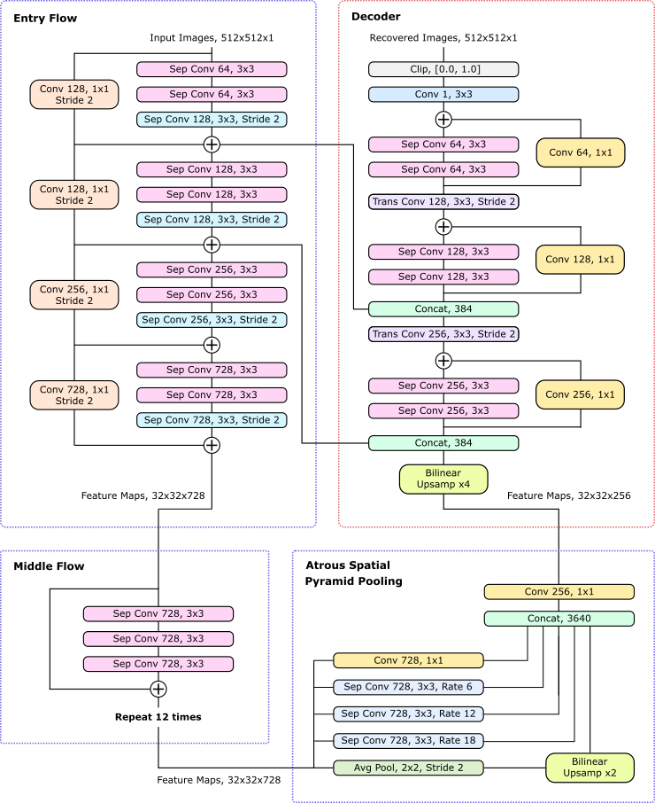

# Low-Dose Transmission Electron Micrograph Denoiser

This repository is for a deep atrous convolutional encoder-decoder trained to remove Poisson noise from low-dose transmission electron micrographs. It outperforms existing methods by 24.6% and has a batch size 1 inference time of 77.0 ms. More details will be found in a paper published on it soon.

The repository contains a checkpoint for the fully trained network, a training script `denoiser-multi-gpu.py` and an inference script `denoiser.py`. The training script is written for multi-GPU training in a distributed setting and the inference script loads the neural network once for repeated inference.

<p align="center">
  
</p>

## Download

To get the training and inference scripts, simply copy the files from or clone this repository:

```
git clone https://github.com/Jeffrey-Ede/Electron-Micrograph-Denoiser.git
cd Electron-Micrograph-Denoiser
```

The last saved checkpoint for the fully trained neural network is available [here](https://drive.google.com/open?id=1ehfRekaNUc1NJzjXeyhF3Tv9kOVWt8wN). To use it, change the location in `checkpoint` to the location you save your copy of the network to.

## Dependencies

This neural network was trained using TensorFlow and requires it and other common python libraries. Most of these libraries come with modern python distributions by default. If you don't have some of these libraries, they can be installed using pip or another package manager. 

Libraries you need for both training and inference:

* tensorFlow
* numpy
* cv2
* functools
* itertools
* collections
* six
* os

For training you also need:

* argparse
* random
* scipy
* Image

## Example Usage

This short script gives an example of inference where the neural network is loaded once and applied to denoise multiple images:

```python
import numpy as np
from denoiser import Denoiser, disp

#Create a 1500x1500 image from random numbers for demonstration
#Try replacing this with your own image!
img = np.random.rand(1500, 1500)

#Initialize the denoising neural network
noise_remover = Denoiser()

#Denoise a 512x512 crop from the image
crop = img[:512,:512]
denoised_crop = noise_remover.denoise_crop(crop)

#Denoise the entire image
denoised_img = noise_remover.denoise(img)

#Use the disp function to display the results
disp(crop) #Crop before denoising
disp(denoised_crop) #Crop after denoising
disp(img) #Image before denoising
disp(denoised_img) #Image after denoising
```

To continue training the neural network; end-to-end or to fine-tune it, you will need to adjust some of the variables at the top of the `denoiser-multi-gpu.py` training file. Specifically, variables indicating the location of your datasets and locations to save logs and checkpoints to.

## Neural Network Info

This neural network is inspired by networks Google developed for semantic image segementation. It was developed with the aim of testing how well a deep atrous convolutional encode-decoder architecture can denoise trasmission electron electron micrographs. The answer is pretty well! When tested on 20000 unseen micrographs it had a mean squared error 24.6% better than existing denoising methods with an average batch size 1 inference time of 77.0 ms for 1 GTX 1080 Ti GPU and a 3.4 GHz i7-6700 processor. More details will be available in the paper when it is published.

## Example Applications

Example applications of the neural network to 512x512 crops are coming on Monday!

## Incomplete! 

This repository is still in the works! I'm in the process of writing up a paper, publishing the training, validation and test data and neatening up my source code. Nevertheless, the neural network published here is now in a working state. I'll make sure everything else is on Monday.

[Trained neural network](<add link>)
